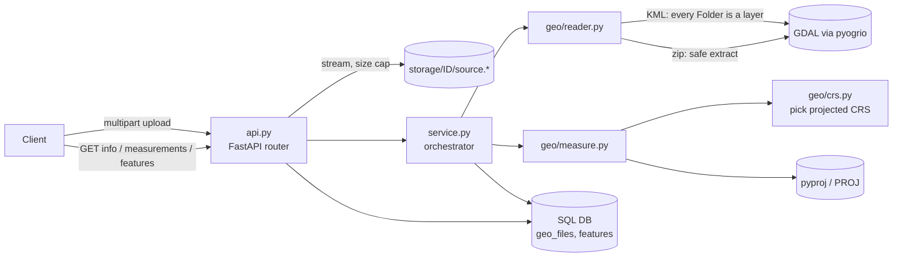
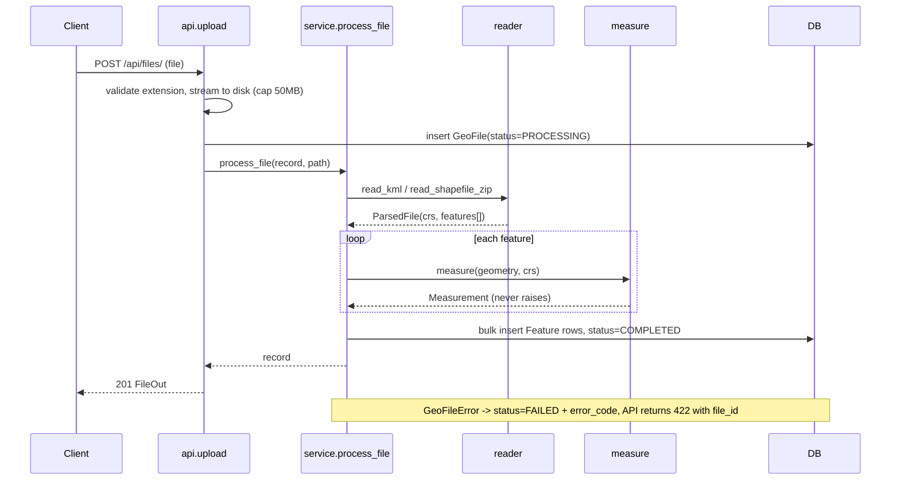
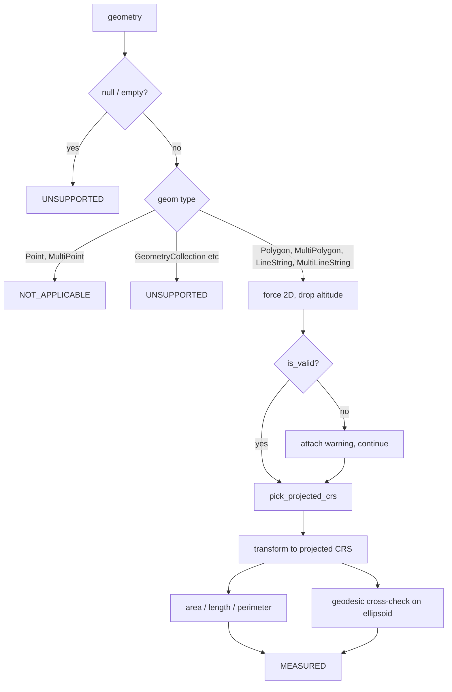

# Geospatial File Measurement API

A production-quality FastAPI backend service that accepts geospatial files (Shapefile `.zip` or `.kml`), parses and extracts geometric features, and calculates geometric measurements (polygon area/perimeter, linestring length) using dynamic **projected Coordinate Reference Systems (CRS)** rather than degree-based ellipsoidal distortion.

---

## Quick Start

### Local Setup (Virtual Environment)

```bash
# 1. Create and activate a Python 3.12 virtual environment
python -m venv .venv
source .venv/bin/activate  # On Windows: .venv\Scripts\activate

# 2. Install dependencies
pip install -r requirements-dev.txt

# 3. Run the development server
uvicorn app.main:app --reload --host 0.0.0.0 --port 8000

# 4. Run the test suite (23 tests)
pytest -v
```

Interactive OpenAPI documentation is available at:
- Swagger UI: [http://localhost:8000/docs](http://localhost:8000/docs)
- ReDoc: [http://localhost:8000/redoc](http://localhost:8000/redoc)

### Docker & Docker Compose

Run the full stack with PostgreSQL via Docker Compose:

```bash
docker compose up --build
```

The API will be available at `http://localhost:8000`.

---

## API Reference

### Endpoints Overview

| Method | Endpoint | Description |
|---|---|---|
| `POST` | `/api/files/` | Upload and process a Shapefile (`.zip`) or KML file. Supports optional `?assume_crs=`. |
| `GET` | `/api/files/` | List uploaded files with pagination (`limit`, `offset`). |
| `GET` | `/api/files/{id}/` | Get metadata, status, CRS, and feature count for a file. |
| `GET` | `/api/files/{id}/measurements/` | Get calculated measurements (area, length, perimeter) + summary metrics. |
| `GET` | `/api/files/{id}/features/` | Get extracted features with GeoJSON geometries and properties. |
| `DELETE` | `/api/files/{id}/` | Delete a file record, its associated features, and stored disk assets. |
| `GET` | `/health` | Health check endpoint. |

---

### Detailed Endpoint Specifications & Sample Responses

#### 1. Upload File
`POST /api/files/` (multipart form-data, parameter `file`)

```bash
curl -F "file=@samples/sample.kml" http://localhost:8000/api/files/
```

**Response (`201 Created`):**
```json
{
  "id": "5338e682042546d78f5df275502633c3",
  "filename": "sample.kml",
  "file_type": "KML",
  "status": "COMPLETED",
  "crs": "EPSG:4326",
  "feature_count": 3,
  "warnings": [],
  "error_code": null,
  "error_message": null,
  "created_at": "2026-10-07T18:51:58.285642Z",
  "processed_at": "2026-10-07T18:51:58.381235Z"
}
```

*Error cases:*
- `413 FILE_TOO_LARGE`: Upload exceeds 50MB.
- `422 Unprocessable Entity`: Validation or parsing failure (`UNSUPPORTED_FILE_TYPE`, `INVALID_ZIP`, `ZIP_TOO_LARGE`, `ZIP_TOO_MANY_ENTRIES`, `NO_SHAPEFILE`, `INCOMPLETE_SHAPEFILE`, `UNREADABLE_SHAPEFILE`, `UNREADABLE_KML`, `MISSING_CRS`, `NO_FEATURES`). Recorded with `status: FAILED` and returns `{ "detail": { "code": "...", "message": "...", "file_id": "..." } }`.

#### 2. File Information
`GET /api/files/{id}/`

```bash
curl http://localhost:8000/api/files/5338e682042546d78f5df275502633c3/
```

Returns the file record matching the upload response structure.

#### 3. Measurements
`GET /api/files/{id}/measurements/`  
*Query parameters:* `limit` (default 100), `offset` (default 0), `geometry_type` (optional filter: `Polygon`, `LineString`, `Point`), `include_geometry` (default `false`).

```bash
curl "http://localhost:8000/api/files/5338e682042546d78f5df275502633c3/measurements/?geometry_type=Polygon"
```

**Response (`200 OK`):**
```json
{
  "file_id": "5338e682042546d78f5df275502633c3",
  "crs": "EPSG:4326",
  "total": 3,
  "limit": 100,
  "offset": 0,
  "summary": {
    "total_area_m2": 1201853.26,
    "total_area_ha": 120.19,
    "total_length_m": 1085.84,
    "by_geometry_type": {
      "Polygon": 1,
      "LineString": 1,
      "Point": 1
    },
    "by_status": {
      "MEASURED": 2,
      "NOT_APPLICABLE": 1
    }
  },
  "items": [
    {
      "index": 0,
      "geometry_type": "Polygon",
      "status": "MEASURED",
      "area_m2": 1201853.26,
      "area_ha": 120.19,
      "length_m": null,
      "perimeter_m": 4385.36,
      "projected_crs": "EPSG:32643",
      "geodesic_area_m2": 1200618.25,
      "geodesic_length_m": 4383.11,
      "warning": null,
      "geometry": null
    }
  ]
}
```

#### 4. Features
`GET /api/files/{id}/features/`  
*Query parameters:* `limit` (default 100), `offset` (default 0), `geometry_type` (optional), `include_geometry` (default `true`).

```bash
curl "http://localhost:8000/api/files/5338e682042546d78f5df275502633c3/features/"
```

**Response (`200 OK`):**
```json
{
  "file_id": "5338e682042546d78f5df275502633c3",
  "total": 3,
  "limit": 100,
  "offset": 0,
  "items": [
    {
      "index": 0,
      "layer": "source",
      "geometry_type": "Polygon",
      "crs": "EPSG:4326",
      "properties": {
        "Name": "field"
      },
      "geometry": {
        "type": "Polygon",
        "coordinates": [
          [[77.5, 12.9], [77.51, 12.9], [77.51, 12.91], [77.5, 12.91], [77.5, 12.9]]
        ]
      }
    }
  ]
}
```

---

## Architecture

### Clean Layered Architecture

The application enforces a strict separation of concerns:
- **`app/api.py` (HTTP Layer):** Handles routing, query validation, streaming file uploads, HTTP status codes, and JSON serialization. Zero geospatial business logic.
- **`app/service.py` (Orchestration):** Coordinates file ingestion, persistence lifecycles, and joins pure domain parsing with the database.
- **`app/geo/` (Domain Logic):** Pure functions over Shapely, pyproj, and pyogrio objects. Completely decoupled from FastAPI and SQLAlchemy, making it unit-testable in milliseconds and reusable in worker processes or CLI scripts.
- **`app/models.py` & `app/db.py` (Persistence):** SQLAlchemy models tracking file processing lifecycles and feature records with SQLite or PostgreSQL backends.



### File-Processing Flow



### Measurement Flow (Per Feature)



---

## Coordinate Reference System (CRS) Handling

### The Problem
Geographic coordinates (such as WGS84 `EPSG:4326`) express positions in angular degrees (longitude and latitude). Because the physical distance of a degree of longitude shrinks towards the poles, calculating area or distance directly on angular degrees produces nonsensical values (e.g. square degrees) that vary drastically depending on latitude.

### Projection Strategy

| Source CRS | Action Taken | Architectural Rationale |
|---|---|---|
| **Geographic** (e.g. `EPSG:4326`, `EPSG:4269`) | Reproject to **UTM zone of the feature's representative point** (`EPSG:326xx` North / `EPSG:327xx` South) | Conformal, metric, scale distortion `<0.1%` inside zone |
| **Projected with metre units** (e.g. UTM, `EPSG:3857`) | Kept as-is | Already in metric units; avoids unnecessary transform |
| **Projected non-metric** (e.g. US survey feet, `EPSG:2263`) | Reproject to UTM | Normalizes all output measurements strictly to metres |
| **Polar regions** (Latitude $\ge 80^\circ$ or $\le -80^\circ$) | `EPSG:3413` (North) / `EPSG:3031` (South) Polar Stereographic | UTM is undefined near the Earth's poles |
| **Shapefile missing `.prj`** | Reject with `422 MISSING_CRS` unless client provides `?assume_crs=` | Guessing a CRS silently corrupts measurement calculations |
| **KML** | Standardized as `EPSG:4326` | Mandated by the OGC KML standard |

### Additional Spatial Engineering Considerations
1. **Per-Feature UTM Selection:** Multi-feature datasets spanning multiple UTM zones are projected per-feature to their respective optimal zone rather than imposing a single arbitrary zone across the entire file.
2. **`representative_point()` vs `centroid`:** `shapely.representative_point()` is strictly used instead of `centroid()` because the centroid of irregular or concave survey shapes (e.g., crescent boundaries, corridor flightpaths) can fall outside the geometry into an adjacent zone.
3. **Independent Geodesic Cross-Check:** For geographic sources, geodesic area and perimeter/length are computed on the WGS84 ellipsoid via `pyproj.Geod` and returned alongside projected measurements. In tests, projected UTM area matches ellipsoidal geodesic area within `<0.2%`.
4. **Altitude Handling:** 3D coordinates in KML/Shapefile data are flattened to 2D plane coordinates (`shapely.force_2d`), ensuring surface-plane survey measurements.

---

## Design Decisions

| Decision | Chosen Solution | Alternative Considered | Trade-off Rationale |
|---|---|---|---|
| **Web Framework** | FastAPI | Django + DRF | Strict typing, Pydantic schemas, async request handling, automated OpenAPI documentation. Minimal overhead for an API-centric service. |
| **Processing Mode** | Synchronous with persistent status lifecycle (`PROCESSING` $\to$ `COMPLETED` / `FAILED`) | Celery / RQ + Redis | Files capped at 50MB parse in sub-second to a few seconds; synchronous keeps the take-home free from heavy background broker infra. The status lifecycle makes moving to Celery a non-breaking change. |
| **Geometry Storage** | Standard GeoJSON in JSON column | PostGIS geometry column | Zero external spatial DB dependencies (runs instantly on SQLite/PostgreSQL). PostGIS is ideal for spatial querying in future iterations. |
| **Database** | SQLite default with PostgreSQL via `GEO_DATABASE_URL` | PostgreSQL only | Allows reviewers and automated CI to run tests in seconds without configuring database services. |
| **Geospatial Engine** | `geopandas` + `pyogrio` + `shapely` | `fiona`, `fastkml`, `gdal-python` | `pyogrio` bundles modern GDAL wheels with zero complex C-library system compilation, supporting both Shapefile and multi-layer KML with unified DataFrames. |
| **Multi-Folder KML** | Iterate all layers via `pyogrio.list_layers` | Default single-layer read | Standard GDAL readers only parse the first layer by default, which silently drops Placemarks nested in KML `<Folder>` elements. |
| **Invalid Geometries** | Calculate measurement + attach diagnostic warning | Automatic `make_valid` repair | Automatic repair mutates geometric shape and boundary coordinates without user consent; surfacing warnings maintains transparency. |
| **Fault Isolation** | Per-feature `ERROR` / `UNSUPPORTED` state | Fail entire file upload | Mirrors real-world drone telemetry: a single corrupt polygon shouldn't abort processing for hundreds of valid survey parcels. |
| **Identifiers** | 32-character UUID hex | Auto-incrementing integers | Prevents enumeration attacks; safe for distributed systems and public REST endpoints. |

---

## Security & Robustness

- **Zip-Slip Protection:** Extracted files use `Path(entry).name` into temporary directories, eliminating directory traversal vectors (`../../evil.shp`).
- **Zip-Bomb Protection:** Archives with `>100` entries or uncompressed sizes `>300MB` are rejected before extraction.
- **Whitelist Extraction:** Only valid shapefile components (`.shp`, `.shx`, `.dbf`, `.prj`, `.cpg`) are unpacked. macOS metadata (`__MACOSX`, `._*`) is automatically ignored.
- **Upload Hard Cap:** Upload streams are processed in 1MB chunks and aborted at 50MB, immediately cleaning up temporary disk assets.
- **Sanitized Storage:** Files are stored using internal UUID directory paths (`storage/<uuid>/source.<ext>`), preventing filesystem overwrite attacks.

---

## Testing Suite

The project includes **23 automated tests** covering geometric accuracy, reader robustness, zip security, and API endpoints:

```bash
pytest -v
```

### Test Coverage Highlights
- **1km² Benchmark Squares:** Verified across UTM zones in both Northern and Southern hemispheres (`EPSG:32643`, `EPSG:32632`, `EPSG:32755`) converted from WGS84, measuring exactly $1,000,000\,\text{m}^2 \pm 0.2\%$, matching geodesic ellipsoidal calculation within $\pm 0.5\%$.
- **Polygon Holes & MultiPolygons:** Verified that nested interior rings correctly subtract area and multi-polygons sum accurately.
- **Geodesic Distance Verification:** 1 degree of latitude measured at $\approx 110.7\,\text{km}$.
- **Degree Guardrail:** Verified that degree coordinates are never used as metric measurements.
- **KML Multi-Folder Parsing:** Verified extraction of all Placemarks across multiple folders and `ExtendedData` attributes.
- **Shapefile Integrity:** Verified `.zip` archives with missing `.prj`, nested directories, and the `?assume_crs=` override.
- **Security Tests:** Tested and blocked zip-slip path traversal and zip-bomb bombs.
- **Full API Flow:** Tested end-to-end KML/Shapefile uploads, pagination, geometry filters, malformed input rejection, and deletions.

---

## Learnings & Technical Insights

1. **Degrees are not Metres:** Directly calculating area in `EPSG:4326` yields meaningless square degrees. Dynamically projecting geometries to their local UTM zone ensures `<0.2%` scale error relative to WGS84 ellipsoidal truth.
2. **GDAL KML Layering:** GDAL maps each `<Folder>` in a KML document to an independent OGR layer. Standard readers that read only the default layer silently drop Placemarks. Iterating all layers via `pyogrio.list_layers` resolves this issue.
3. **`pyproj.Geod` Ring Handling:** Discovered that `pyproj.Geod.geometry_area_perimeter` computes outer hull area and ignores interior rings (holes). Fixed by explicitly iterating exterior and interior rings.
4. **`representative_point()` vs `centroid`:** In irregular drone survey shapes (such as concave quarry perimeters or curved linear infrastructure corridors), the centroid frequently falls outside the geometry. `representative_point()` guarantees a point strictly within the polygon boundary, ensuring the correct UTM zone is selected.
5. **Zip Attack Vectors:** Geospatial archives are inherently prone to zip-slip path traversal and decompression bombs; flattening filenames and capping entry counts is essential in production.

---

## Future Scope

- **Asynchronous Task Queue:** Integrate Celery or ARQ with Redis for background processing of large survey files (>500MB), leveraging the existing `PROCESSING` $\to$ `COMPLETED` state lifecycle with webhook callbacks.
- **PostGIS & Spatial Indexing:** Migrate geometry storage from JSON to native PostGIS geometries with GiST spatial indexing for bounding-box queries, spatial intersections, and spatial joins.
- **Expanded Format Support:** Support for KMZ (zipped KML), GeoJSON, GeoPackage (`.gpkg`), and FlatGeobuf.
- **Equal-Area Projections:** Provide an optional equal-area projection mode (Albers Equal Area or Lambert Azimuthal Equal Area) for regional surveys spanning multiple UTM zones.
- **Frontend Map Visualizer:** A lightweight React + MapLibre / Leaflet map interface to visually inspect uploaded drone boundaries, linestrings, and measurement summaries.
