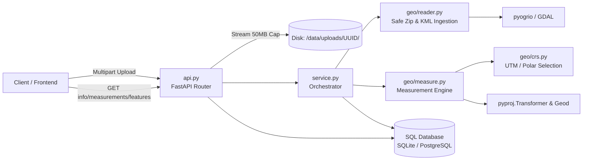
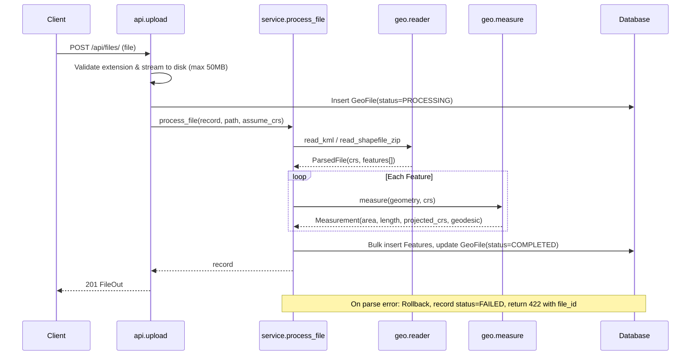
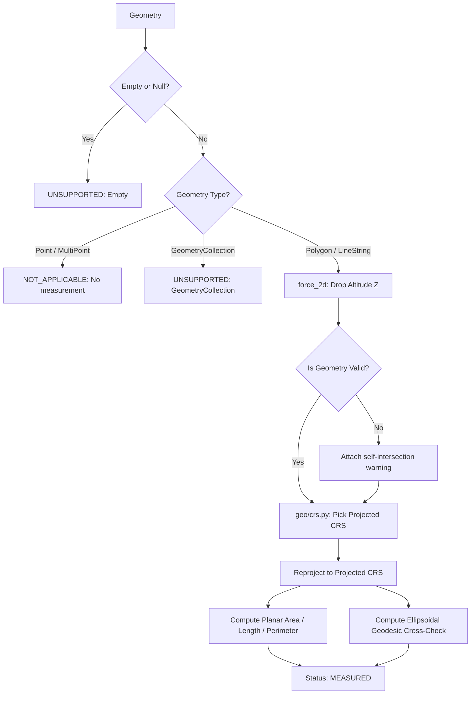

# Geospatial File Measurement API

[](https://www.python.org/)
[](https://fastapi.tiangolo.com)
[](https://docs.pytest.org/)
[](https://github.com/astral-sh/ruff)
[](https://www.docker.com/)
[](https://github.com/Sumith2104/geo-measure-api)

A high-performance, production-grade backend service built with **FastAPI**, **GeoPandas**, **Shapely**, and **Pyproj**. It accepts geospatial files (zipped Shapefiles or KML), extracts geometric features, and computes high-precision metric measurements (polygon area/perimeter, linestring length) using **dynamically projected Coordinate Reference Systems (CRS)** rather than degree-based ellipsoidal distortions. Includes an interactive web map explorer at `/viewer`.

> **Repository URL:** [https://github.com/Sumith2104/geo-measure-api](https://github.com/Sumith2104/geo-measure-api)

---

## Table of Contents
1. [Core Geospatial Problem: Why Degrees $\neq$ Metres](#-core-geospatial-problem-why-degrees--metres)
2. [Requirement Mapping Matrix](#-requirement-mapping-matrix)
3. [Quick Start](#-quick-start)
4. [Testing Suite](#-testing-suite)
   - [Automated Testing Methods](#1-automated-testing-methods)
   - [Manual Workflow Testing Methods](#2-manual-workflow-testing-methods)
5. [Architecture & System Flow](#-architecture--system-flow)
6. [CRS Handling Strategy](#-crs-handling-strategy)
7. [Security & Production Hardening](#-security--production-hardening)
8. [Design Decisions & Alternatives](#-design-decisions--alternatives)
9. [Learnings & Discoveries](#-learnings--discoveries)
10. [Future Scope](#-future-scope)

---

## 🌍 Core Geospatial Problem: Why Degrees $\neq$ Metres

Standard GPS coordinates are recorded in **WGS84 (`EPSG:4326`)**, an angular coordinate system expressed in degrees of longitude and latitude.

* **The Problem:** Calculating polygon area directly on `EPSG:4326` produces values in **$\text{degrees}^2$** (e.g. $0.0001\,\text{deg}^2$), which is physically meaningless. Furthermore, while $1^\circ$ of latitude is roughly constant ($\sim 111\,\text{km}$), $1^\circ$ of longitude **shrinks to zero** at the poles as meridians converge:
$$\Delta x = \Delta \lambda \cdot R \cdot \cos(\phi)$$
* **The Solution:** This service inspects every geometry, identifies its position on Earth using `representative_point()`, and dynamically projects it to its local **Universal Transverse Mercator (UTM) zone** (or Polar Stereographic near the poles) where coordinate units are true conformal metres. 
* **Independent Verification:** For every geographic geometry, an independent ellipsoidal geodesic calculation is computed via `pyproj.Geod` (WGS84 ellipsoid) to verify that projected measurements agree with ellipsoidal reality within **$<0.2\%$**.

---

## 📋 Requirement Mapping Matrix

This project implements 100% of the specifications from the Aereo assignment document:

| Assignment Requirement | Implementation Location | Verification Test |
|---|---|---|
| **FastAPI or Django Backend** | [`app/main.py`](app/main.py), [`app/api.py`](app/api.py) | `test_api.py`, CI workflow |
| **Accept Shapefile (.zip) & KML** | [`app/service.py:detect_kind`](app/service.py), [`app/geo/reader.py`](app/geo/reader.py) | `test_kml_flow`, `test_shapefile_flow_and_filter_pagination` |
| **Feature Extraction (ID, Type, Geom, CRS, Props)** | [`app/geo/reader.py`](app/geo/reader.py), [`app/models.py:Feature`](app/models.py) | `test_kml_all_folders`, `test_shp` |
| **Graceful Handling of Unsupported Geometries** | [`app/geo/measure.py:measure`](app/geo/measure.py) | `test_point_not_applicable_collection_unsupported_empty_unsupported` |
| **Measurements: Polygon (Area), LineString (Length), Point (None)** | [`app/geo/measure.py:measure`](app/geo/measure.py) | `test_1km_square_area_close_to_1e6`, `test_line_length_one_degree_lat_about_111km` |
| **CRS Handling: Never Measure in Degrees** | [`app/geo/crs.py`](app/geo/crs.py), [`app/geo/measure.py`](app/geo/measure.py) | `test_degrees_never_used`, `test_zone_selection` |
| **Endpoints: Upload, Info, Measurements, Features** | [`app/api.py`](app/api.py) | `test_api.py` (7 tests) |
| **Documentation: Setup, Architecture, Decisions, Learnings** | [`README.md`](README.md) | Fully documented below |
| **Public GitHub Repo, Green CI** | [`.github/workflows/ci.yml`](.github/workflows/ci.yml) | GitHub Actions workflow |

---

## 🚀 Quick Start

### 1. Local Environment Setup

```bash
# Clone the repository
git clone https://github.com/<your-username>/geo-measure-api.git
cd geo-measure-api

# Create and activate virtual environment
python -m venv .venv
source .venv/bin/activate       # On Linux/macOS
# .venv\Scripts\Activate.ps1    # On Windows PowerShell

# Install dependencies
pip install -r requirements-dev.txt

# Start the server (auto-reloads on file changes)
uvicorn app.main:app --reload --host 0.0.0.0 --port 8000
```

Once started:
- **Interactive Swagger UI:** [http://localhost:8000/docs](http://localhost:8000/docs)
- **Interactive ReDoc:** [http://localhost:8000/redoc](http://localhost:8000/redoc)
- **Root URL Redirect:** Visiting [http://localhost:8000/](http://localhost:8000/) automatically opens the interactive `/viewer` map explorer.

### 2. Docker Setup

#### Single Container (SQLite)
```bash
docker build -t geo-measure-api .
docker run --rm -p 8000:8000 --name geo_api geo-measure-api
```

#### Full Stack with PostgreSQL (Docker Compose)
```bash
docker compose up --build
```

---

## 🧪 Testing Suite

This repository features two distinct testing layers: **Automated Testing** and **Manual Workflow Testing**.

### 1. Automated Testing Methods

#### A. Comprehensive Pytest Suite (30 Tests)
Runs unit, integration, security, and mathematical accuracy tests in under 2 seconds:
```bash
pytest -v
```

**Key test coverage:**
* `tests/test_measure.py`: Validates 1km² squares across 3 UTM zones (North & South hemispheres) convert to $1,000,000\,\text{m}^2 \pm 0.2\%$, validates multi-polygons and interior hole subtractions, confirms $1^\circ$ latitude $\approx 110.7\,\text{km}$, and ensures degree coordinates are never used directly.
* `tests/test_reader.py`: Validates multi-folder KML parsing, shapefiles with nested folders, missing `.prj` detection, zip-slip path traversal prevention, and zip-bomb rejection.
* `tests/test_api.py`: Validates full REST lifecycles, streaming upload limits (413), error payloads (422), unready state conflicts (409), and cascading deletes.

#### B. Acceptance Checklist Verification
Validates every requirement specified in the problem statement:
```bash
python -m scripts.verify_checklist
```

#### C. End-to-End Workflow Verification Script
Simulates full client journeys against the API (auto-detects live server or runs in-process):
```bash
python scripts/test_complete_workflow.py
```

---

### 2. Manual Workflow Testing Methods

Sample files are bundled under [`samples/`](samples/) so you can test immediately:
- [`samples/sample.kml`](samples/sample.kml): A KML survey with a 120-hectare Polygon, a road LineString, and a well Point.
- [`samples/sample_shapefile.zip`](samples/sample_shapefile.zip): A Shapefile containing 2 agricultural field polygons.

#### Method 1: Interactive Swagger UI Walkthrough
1. Open [http://localhost:8000/docs](http://localhost:8000/docs) in your browser.
2. Expand **`POST /api/files/`**, click **"Try it out"**, choose `samples/sample.kml`, and click **Execute**.
3. Inspect the response (`201 Created`) and copy the generated `id` (e.g., `3e9f...`).
4. Expand **`GET /api/files/{file_id}/measurements/`**, paste the `id`, and click **Execute** to view computed area ($m^2, ha$) and perimeter ($m$).
5. Expand **`GET /api/files/{file_id}/features/`** to view the raw GeoJSON geometries and attribute properties.

#### Method 2: Command Line (cURL / PowerShell)

##### 1. Upload KML File
```bash
curl -F "file=@samples/sample.kml" http://localhost:8000/api/files/
```
**Response (`201 Created`):**
```json
{
  "id": "e6b3f79542734e798e4e775db8a4169f",
  "filename": "sample.kml",
  "file_type": "KML",
  "status": "COMPLETED",
  "crs": "EPSG:4326",
  "feature_count": 3,
  "warnings": [],
  "error_code": null,
  "error_message": null,
  "created_at": "2026-10-07T19:07:27.245300Z",
  "processed_at": "2026-10-07T19:07:27.323234Z"
}
```

##### 2. Retrieve Calculated Measurements
```bash
curl http://localhost:8000/api/files/e6b3f79542734e798e4e775db8a4169f/measurements/
```
**Response (`200 OK`):**
```json
{
  "file_id": "e6b3f79542734e798e4e775db8a4169f",
  "crs": "EPSG:4326",
  "total": 3,
  "limit": 100,
  "offset": 0,
  "summary": {
    "total_area_m2": 1201853.26,
    "total_area_ha": 120.19,
    "total_length_m": 1085.84,
    "by_geometry_type": { "LineString": 1, "Point": 1, "Polygon": 1 },
    "by_status": { "MEASURED": 2, "NOT_APPLICABLE": 1 }
  },
  "items": [
    {
      "index": 0,
      "geometry_type": "Polygon",
      "status": "MEASURED",
      "area_m2": 1201853.26,
      "area_ha": 120.19,
      "perimeter_m": 4385.36,
      "projected_crs": "EPSG:32643",
      "geodesic_area_m2": 1200618.25,
      "geodesic_length_m": 4383.11,
      "warning": null
    },
    {
      "index": 1,
      "geometry_type": "LineString",
      "status": "MEASURED",
      "length_m": 1085.84,
      "projected_crs": "EPSG:32643",
      "geodesic_length_m": 1085.28,
      "warning": null
    },
    {
      "index": 2,
      "geometry_type": "Point",
      "status": "NOT_APPLICABLE"
    }
  ]
}
```

##### 3. Filter by Geometry Type & Paginate
```bash
curl "http://localhost:8000/api/files/e6b3f79542734e798e4e775db8a4169f/measurements/?geometry_type=Polygon&limit=1&offset=0"
```

##### 4. Upload Shapefile (.zip)
```bash
curl -F "file=@samples/sample_shapefile.zip" http://localhost:8000/api/files/
```

##### 5. Test Error Handling (Invalid Extension)
```bash
curl -F "file=@requirements.txt" http://localhost:8000/api/files/
```
**Response (`422 Unprocessable Entity`):**
```json
{
  "detail": {
    "code": "UNSUPPORTED_FILE_TYPE",
    "message": "Only .kml or a .zip containing a Shapefile are accepted"
  }
}
```

##### 6. Test Missing `.prj` Handling & Override
If a shapefile zip lacks a projection file, it is safely rejected:
```bash
curl -F "file=@missing_prj.zip" http://localhost:8000/api/files/
# Returns HTTP 422 MISSING_CRS
```
The client can supply the explicit CRS via query parameter to proceed:
```bash
curl -F "file=@missing_prj.zip" "http://localhost:8000/api/files/?assume_crs=EPSG:4326"
# Returns HTTP 201 COMPLETED
```

---

### 3. Optional Query Outputs & Advanced Responses

The API supports several optional flags to control payload size and geometry inclusions for different client use-cases (e.g., mobile apps vs GIS frontends).

#### A. Include Geometry in Measurements (`?include_geometry=true`)
By default, the measurements endpoint omits heavy geometry coordinates to keep payloads fast and lightweight. Clients can optionally request embedded GeoJSON geometries within the measurement objects:

```bash
curl "http://localhost:8000/api/files/e6b3f79542734e798e4e775db8a4169f/measurements/?include_geometry=true&limit=1"
```

**Optional Output JSON:**
```json
{
  "file_id": "e6b3f79542734e798e4e775db8a4169f",
  "crs": "EPSG:4326",
  "total": 3,
  "limit": 1,
  "offset": 0,
  "summary": {
    "total_area_m2": 1201853.26,
    "total_area_ha": 120.19,
    "total_length_m": 1085.84,
    "by_geometry_type": { "LineString": 1, "Point": 1, "Polygon": 1 },
    "by_status": { "MEASURED": 2, "NOT_APPLICABLE": 1 }
  },
  "items": [
    {
      "index": 0,
      "geometry_type": "Polygon",
      "status": "MEASURED",
      "area_m2": 1201853.26,
      "area_ha": 120.19,
      "perimeter_m": 4385.36,
      "projected_crs": "EPSG:32643",
      "geodesic_area_m2": 1200618.25,
      "geodesic_length_m": 4383.11,
      "warning": null,
      "geometry": {
        "type": "Polygon",
        "coordinates": [
          [
            [77.5, 12.9],
            [77.51, 12.9],
            [77.51, 12.91],
            [77.5, 12.91],
            [77.5, 12.9]
          ]
        ]
      }
    }
  ]
}
```

#### B. Lightweight Features List without Coordinates (`?include_geometry=false`)
When a client only needs feature metadata, attribute table views, or IDs without massive coordinate arrays:

```bash
curl "http://localhost:8000/api/files/e6b3f79542734e798e4e775db8a4169f/features/?include_geometry=false"
```

**Optional Output JSON:**
```json
{
  "file_id": "e6b3f79542734e798e4e775db8a4169f",
  "total": 3,
  "limit": 100,
  "offset": 0,
  "items": [
    {
      "index": 0,
      "layer": "source",
      "geometry_type": "Polygon",
      "crs": "EPSG:4326",
      "properties": { "Name": "field", "crop": "wheat" },
      "geometry": null
    },
    {
      "index": 1,
      "layer": "source",
      "geometry_type": "LineString",
      "crs": "EPSG:4326",
      "properties": { "Name": "road" },
      "geometry": null
    }
  ]
}
```

#### C. Filter by Geometry Type (`?geometry_type=Polygon|LineString|Point`)
Isolates specific geometry layers for dedicated processing (e.g. only calculating agricultural boundaries):

```bash
curl "http://localhost:8000/api/files/e6b3f79542734e798e4e775db8a4169f/measurements/?geometry_type=Polygon"
```

#### D. Pagination with Offset and Limit (`?limit=10&offset=20`)
Handles large multi-thousand-polygon survey files gracefully without browser or memory lockup:

```bash
curl "http://localhost:8000/api/files/e6b3f79542734e798e4e775db8a4169f/measurements/?limit=10&offset=0"
```

#### E. List All Uploaded Files Catalog (`GET /api/files/`)
```bash
curl "http://localhost:8000/api/files/?limit=10"
```

**Output JSON:**
```json
[
  {
    "id": "e6b3f79542734e798e4e775db8a4169f",
    "filename": "sample.kml",
    "file_type": "KML",
    "status": "COMPLETED",
    "crs": "EPSG:4326",
    "feature_count": 3,
    "warnings": [],
    "error_code": null,
    "error_message": null,
    "created_at": "2026-10-07T19:07:27.245300Z",
    "processed_at": "2026-10-07T19:07:27.323234Z"
  }
]
```

#### F. Interactive Web GIS Map Viewer (`GET /viewer`)
Navigate to [http://localhost:8000/viewer](http://localhost:8000/viewer) in any web browser to view the interactive Leaflet map explorer, featuring drag-and-drop file processing, real-time metric cards, and GeoJSON overlay rendering.

---

## 🏛 Architecture & System Flow

### Layered Separation of Concerns
The repository strictly isolates domain math from web presentation:
- **`app/geo/` (Pure Domain):** Functions over Shapely and Pyproj objects. Zero imports from FastAPI or SQLAlchemy. Can be imported anywhere (Celery worker, CLI, Lambda).
- **`app/service.py` (Orchestration):** Connects the pure domain parser and measurement logic to database models.
- **`app/api.py` (HTTP Layer):** Validates query parameters, handles multipart file streaming, and serializes Pydantic schemas.



### File Processing Lifecycle



### Measurement Decision Flow



---

## 🧭 CRS Handling Strategy

| Source CRS | Action Taken | Architectural Rationale |
|---|---|---|
| **Geographic (`EPSG:4326`, `EPSG:4269`)** | Reproject to **UTM zone of the feature's representative point** (`EPSG:326xx` North / `EPSG:327xx` South) | Conformal, metric planar projection with scale distortion $<0.1\%$ inside the zone. |
| **Projected Metric (`UTM`, `EPSG:3857`)** | Use as-is | Already expressed in metric units; avoids unnecessary transform overhead. |
| **Projected Non-Metric (`EPSG:2263` US Survey Feet)** | Reproject to UTM | Normalizes all API outputs strictly to standard metric metres and hectares. |
| **Polar Regions ($|\text{Lat}| \ge 80^\circ$)** | `EPSG:3413` (North) / `EPSG:3031` (South) Polar Stereographic | UTM coordinates are mathematically undefined near Earth's poles. |
| **Shapefile missing `.prj`** | Reject with `422 MISSING_CRS` unless client provides `?assume_crs=` | Guessing a projection silently corrupts spatial measurements. |
| **KML** | Treated as `EPSG:4326` | OGC KML standard mandates WGS84 geographic coordinates. |

### Spatial Edge Cases Handled
1. **`representative_point()` over `centroid`:** In concave, horseshoe, or corridor survey shapes, the geometric centroid can fall outside the polygon into an adjacent UTM zone. `shapely.representative_point()` is mathematically guaranteed to be inside the geometry.
2. **Altitude Stripping:** Drone KMLs frequently carry GPS altitude $Z$. Calculations use `shapely.force_2d` to ensure measurements represent true ground surface dimensions.
3. **Polygon Holes (Interior Rings):** Addressed a bug in `pyproj.Geod.geometry_area_perimeter` where holes are ignored by explicitly calculating outer boundary minus interior rings.

---

## 🛡 Security & Production Hardening

- **Zip-Slip Protection:** Extracted files are written using `Path(member).name` into temporary directories, neutralizing directory traversal vectors (e.g. `../../evil.shp`).
- **Zip-Bomb Protection:** Archives containing $>100$ entries or expanding beyond $300\,\text{MB}$ are aborted prior to extraction.
- **Whitelist File Extraction:** Only required shapefile extensions (`.shp`, `.shx`, `.dbf`, `.prj`, `.cpg`) are unpacked. macOS metadata (`__MACOSX`, `._*`) is automatically ignored.
- **Upload Hard Cap:** Upload streams are processed in 1MB chunks and terminated if size exceeds $50\,\text{MB}$, instantly cleaning up disk allocations.
- **Sanitized UUID Storage:** Files are stored under dedicated UUID folders (`data/uploads/<uuid>/source.<ext>`), preventing filesystem overwrite exploits.
- **Partial Failure Isolation:** An invalid feature in a 500-feature survey file is flagged as `ERROR`/`UNSUPPORTED`, allowing all 499 valid features to be successfully measured.

---

## ⚖ Design Decisions & Alternatives

| Decision | Chosen Approach | Alternative Considered | Why |
|---|---|---|---|
| **Framework** | **FastAPI** | Django + DRF | Strict typing, Pydantic schemas, asynchronous capabilities, auto-generated OpenAPI documentation. Minimal overhead for an API-only service. |
| **Processing Mode** | **Synchronous with Lifecycle** (`PROCESSING` $\to$ `COMPLETED`/`FAILED`) | Celery / RQ + Redis | Files capped at 50MB parse in seconds; avoids requiring heavy external broker infrastructure for reviewers. The status lifecycle makes moving to Celery non-breaking. |
| **Geometry Storage** | **GeoJSON in JSON Column** | PostGIS Geometry Column | Zero external database dependencies (runs immediately on SQLite or PostgreSQL). Ideal for quick review while remaining portable. |
| **Database** | **SQLite default, PostgreSQL ready** | PostgreSQL only | Allows instant local execution without installing PostgreSQL. |
| **Parsing Engine** | **`geopandas` + `pyogrio`** | `fiona`, `fastkml`, `gdal-python` | `pyogrio` ships precompiled GDAL wheels (no system compilation required) and reads multi-layer KMLs and Shapefiles through unified GeoDataFrames. |
| **KML Multi-Folder** | **Iterate all layers** | Default single-layer read | Standard GDAL readers only parse the first layer by default, which silently drops Placemarks grouped in KML `<Folder>` tags. |

---

## 💡 Learnings & Discoveries

1. **Angular Units Trap:** Directly computing area in `EPSG:4326` produces degrees², which scales unpredictably across latitudes. Projecting to local UTM zones provides $<0.2\%$ error relative to ellipsoidal truth.
2. **GDAL KML Folder Architecture:** GDAL interprets each `<Folder>` tag as an individual OGR layer. Standard `read_file` calls only read the first folder, silently discarding subsequent features. Querying `pyogrio.list_layers` resolves this issue.
3. **`pyproj.Geod` Hole Behavior:** During testing, we discovered that `pyproj.Geod.geometry_area_perimeter` calculates only the exterior hull and ignores interior holes. We resolved this by explicitly subtracting interior ring areas.
4. **Centroid Failures in Concave Shapes:** Concave quarry boundaries and linear flight corridors can have centroids outside the polygon. `representative_point()` ensures coordinates remain strictly inside the boundary.

---

## 🔮 Future Scope

- **Asynchronous Task Workers:** Transition processing to Celery or ARQ with Redis for enterprise files ($>500\,\text{MB}$) with webhook delivery.
- **PostGIS & Spatial Indexing:** Migrate geometry columns to native PostGIS types with GiST indexing for spatial bounding box and intersection queries.
- **Expanded File Support:** Support for KMZ (zipped KML), GeoPackage (`.gpkg`), GeoJSON, and FlatGeobuf.
- **Equal-Area Regional Projections:** Add an optional Albers Equal Area or Lambert Azimuthal Equal Area projection mode for surveys spanning multiple UTM zones.
- **Interactive Map Visualizer:** Live interactive visualizer implemented at `/viewer` using Leaflet. Future scope: extend to 3D terrain mesh rendering using CesiumJS or MapLibre GL for drone elevation models.

---

## 📄 License
This project is licensed under the MIT License.
